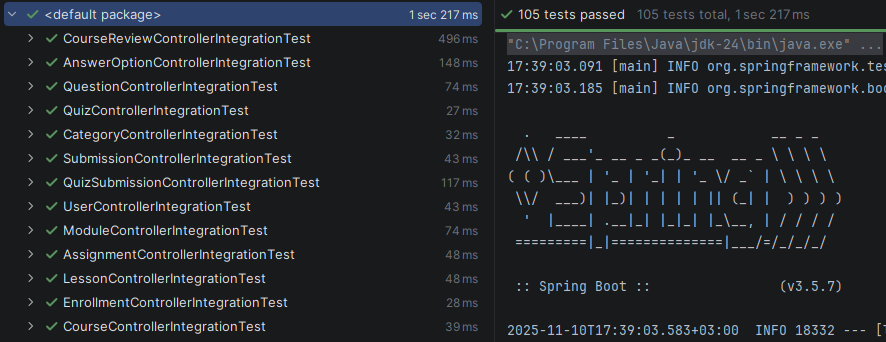

# Learning Management System (LMS)

## Описание

### Возможности системы

- **Управление курсами**: создание курсов с модулями и уроками, организация по категориям
- **Управление пользователями**: регистрация студентов и преподавателей, управление профилями
- **Запись на курсы**: студенты могут записываться на курсы и отслеживать свой прогресс
- **Обучающие материалы**: размещение уроков, заданий и материалов в рамках курсов
- **Тестирование**: создание тестов с вопросами и вариантами ответов, автоматическая проверка
- **Выполнение заданий**: студенты могут отправлять выполненные задания на проверку
- **Система отзывов**: возможность оставлять отзывы и оценки курсам

## Архитектура

### Технологический стек

- **Backend**: Java, Spring Boot, Spring Data JPA, Hibernate
- **База данных**: PostgreSQL
- **Миграции**: Flyway
- **Сборка**: Maven
- **Контейнеризация**: Docker, Docker Compose

### Слои приложения

- **Controller Layer** (Контроллеры)
    - Обработка HTTP-запросов и маршрутизация
    - Валидация входных данных
    - Формирование HTTP-ответов
    - Прямое взаимодействие с Repository Layer

- **Repository Layer** (Слой доступа к данным)
    - Взаимодействие с базой данных через JPA/Hibernate
    - CRUD операции над сущностями

- **DTO (Data Transfer Objects)** - объекты для передачи данных между слоями
- **Mapper** - преобразование между Entity и DTO
- **Model/Entity** - JPA-сущности, представляющие таблицы БД
- **Exception** - обработка исключений

> **Примечание о Service Layer**: В текущей реализации слой сервисов не используется, так как вся логика представляет
> собой простые CRUD операции. Создание дополнительного слоя абстракции без реальной бизнес-логики привело бы к
> избыточности кода. Как только появится настоящая бизнес-логика (сложные транзакции, валидация правил, координация
> между
> несколькими репозиториями), контроллеры будут рефакторены для использования Service Layer вместо прямого обращения к
> репозиториям.

### REST API

Приложение предоставляет RESTful API со следующими основными группами эндпоинтов:

- Пользователи (`/api/users`)
- Категории (`/api/categories`)
- Курсы (`/api/courses`)
- Модули (`/api/modules`)
- Уроки (`/api/lessons`)
- Задания (`/api/assignments`)
- Тесты (`/api/quizzes`)
- Записи на курсы (`/api/enrollments`)
- Отзывы (`/api/reviews`)

## Запуск проекта

Создать `.env` по шаблону `.env.template` (если хотите поменять значения по умолчанию)

Выполнить команду:

```bash
docker compose up -d --build
```

Сервер будет доступен по адресу `http://localhost:8080/`. Также при запуске автоматически добавятся тестовые данные.

## Запуск тестов

Для запуска тестов выполните команду:

```bash
./mvnw test
```

Или на Windows:

```bash
mvnw.cmd test
```

Для запуска с подробным выводом:

```bash
./mvnw test -Dspring.profiles.active=test
```

### Результат тестов



## Доступные эндпоинты

### Пользователи

- `GET /api/users` - Получить всех пользователей
- `GET /api/users/{id}` - Получить пользователя по ID
- `GET /api/users/email/{email}` - Получить пользователя по email
- `POST /api/users` - Создать пользователя
- `PUT /api/users/{id}` - Обновить пользователя
- `DELETE /api/users/{id}` - Удалить пользователя

### Категории

- `GET /api/categories` - Получить все категории
- `GET /api/categories/{id}` - Получить категорию по ID
- `GET /api/categories/name/{name}` - Получить категорию по имени
- `POST /api/categories` - Создать категорию
- `PUT /api/categories/{id}` - Обновить категорию
- `DELETE /api/categories/{id}` - Удалить категорию

### Курсы

- `GET /api/courses` - Получить все курсы
- `GET /api/courses/{id}` - Получить курс по ID
- `GET /api/courses/teacher/{teacherId}` - Получить курсы преподавателя
- `GET /api/courses/category/{categoryId}` - Получить курсы по категории
- `GET /api/courses/category/name/{categoryName}` - Получить курсы по названию категории
- `POST /api/courses` - Создать курс
- `PUT /api/courses/{id}` - Обновить курс
- `DELETE /api/courses/{id}` - Удалить курс

### Записи на курсы

- `GET /api/enrollments` - Получить все записи
- `GET /api/enrollments/{id}` - Получить запись по ID
- `GET /api/enrollments/student/{studentId}` - Получить записи студента
- `GET /api/enrollments/course/{courseId}` - Получить записи на курс
- `GET /api/enrollments/student/{studentId}/course/{courseId}` - Получить запись студента на курс
- `POST /api/enrollments` - Создать запись на курс
- `PUT /api/enrollments/{id}` - Обновить запись
- `DELETE /api/enrollments/{id}` - Удалить запись

### Модули курсов

- `GET /api/modules` - Получить все модули
- `GET /api/modules/{id}` - Получить модуль по ID
- `GET /api/modules/course/{courseId}` - Получить модули курса
- `POST /api/modules` - Создать модуль
- `PUT /api/modules/{id}` - Обновить модуль
- `DELETE /api/modules/{id}` - Удалить модуль

### Уроки

- `GET /api/lessons` - Получить все уроки
- `GET /api/lessons/{id}` - Получить урок по ID
- `GET /api/lessons/module/{moduleId}` - Получить уроки по модулю
- `POST /api/lessons` - Создать урок
- `PUT /api/lessons/{id}` - Обновить урок
- `DELETE /api/lessons/{id}` - Удалить урок

### Задания

- `GET /api/assignments` - Получить все задания
- `GET /api/assignments/{id}` - Получить задание по ID
- `GET /api/assignments/lesson/{lessonId}` - получить задания урока
- `POST /api/assignments` - Создать задание
- `PUT /api/assignments/{id}` - Обновить задание
- `DELETE /api/assignments/{id}` - Удалить задание

### Отправки работ

- `GET /api/submissions` - Получить все отправки работ
- `GET /api/submissions/{id}` - Получить отправку по ID
- `GET /api/submissions/assignment/{assignmentId}` - Получить отправки по заданию
- `GET /api/submissions/student/{studentId}` - Получить отправки студента
- `GET /api/submissions/assignment/{assignmentId}/student/{studentId}` - Получить отправку студента по заданию
- `POST /api/submissions` - Создать отправку работы
- `PUT /api/submissions/{id}` - Обновить отправку
- `DELETE /api/submissions/{id}` - Удалить отправку

### Тесты

- `GET /api/quizzes` - Получить все тесты
- `GET /api/quizzes/{id}` - Получить тест по ID
- `GET /api/quizzes/module/{moduleId}` - Получить тест модуля
- `POST /api/quizzes` - Создать тест
- `PUT /api/quizzes/{id}` - Обновить тест
- `DELETE /api/quizzes/{id}` - Удалить тест

### Вопросы тестов

- `GET /api/questions` - Получить все вопросы
- `GET /api/questions/{id}` - Получить вопрос по ID
- `GET /api/questions/quiz/{quizId}` - Получить вопросы теста
- `POST /api/questions` - Создать вопрос
- `PUT /api/questions/{id}` - Обновить вопрос
- `DELETE /api/questions/{id}` - Удалить вопрос

### Варианты ответов

- `GET /api/answer-options` - Получить все варианты ответов
- `GET /api/answer-options/{id}` - Получить вариант ответа по ID
- `GET /api/answer-options/question/{questionId}` - Получить варианты ответов вопроса
- `POST /api/answer-options` - Создать вариант ответа
- `PUT /api/answer-options/{id}` - Обновить вариант ответа
- `DELETE /api/answer-options/{id}` - Удалить вариант ответа

### Отправки тестов

- `GET /api/quiz-submissions` - Получить все отправки тестов
- `GET /api/quiz-submissions/{id}` - Получить отправку теста по ID
- `GET /api/quiz-submissions/student/{studentId}` - Получить отправки тестов студента
- `GET /api/quiz-submissions/quiz/{quizId}` - Получить отправки по тесту
- `GET /api/quiz-submissions/quiz/{quizId}/student/{studentId}` - Получить отправку студента по тесту
- `POST /api/quiz-submissions` - Создать отправку теста
- `PUT /api/quiz-submissions/{id}` - Обновить отправку теста
- `DELETE /api/quiz-submissions/{id}` - Удалить отправку теста

### Отзывы о курсах

- `GET /api/reviews` - Получить все отзывы
- `GET /api/reviews/{id}` - Получить отзыв по ID
- `GET /api/reviews/course/{courseId}` - Получить отзывы по курсу
- `GET /api/reviews/student/{studentId}` - Получить отзывы студента
- `POST /api/reviews` - Создать отзыв
- `PUT /api/reviews/{id}` - Обновить отзыв
- `DELETE /api/reviews/{id}` - Удалить отзыв

## Сущности

1. `AnswerOption`
2. `Assignment`
3. `Category`
4. `Course`
5. `CourseModule`
6. `CourseReview`
7. `CourseSchedule`
8. `Enrollment`
9. `Lesson`
10. `Material`
11. `Notification`
12. `Profile`
13. `Question`
14. `Quiz`
15. `QuizSubmission`
16. `Submission`
17. `Tag`
18. `User`